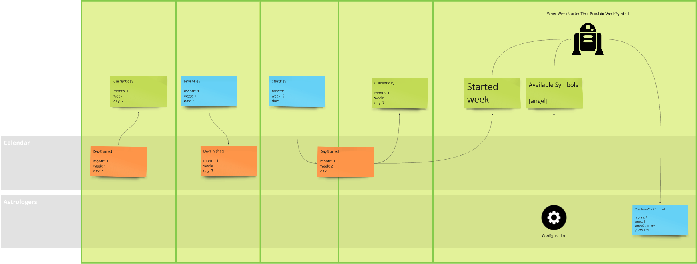
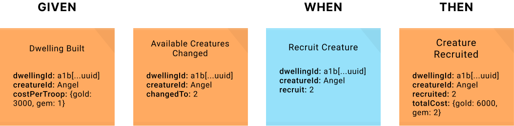

# Heroes of Domain-Driven Design (Ruby)

Shows how to use Domain-Driven Design, Event Storming, Event Modeling and Event Sourcing in Heroes of Might & Magic III domain.

👉 [Read the Heroes of Domain-Driven Design series](https://dddheroes.com/)

This project probably won't be fully-functional HOMM3 engine implementation, because it's done for educational purposes.
If you'd like to talk with me about mentioned development practices fell free to contact on [linkedin.com/in/mateusznakodach/](https://www.linkedin.com/in/mateusznakodach).

I'm focused on domain modeling on the backend, but I've also played around with Rails app frontend using Hotwire.


## 🚀 How to run the project locally?

1. `cd heroesofddd_rails_application`
2. `docker compose up`
3. `bundle install`
2. `rails db:drop db:create db:migrate db:seed` - (re)creates database and seed with example data
7. `rails server`

### Example use case:
- Go to the url: http://127.0.0.1:3000/heroes/games/fcc8f601-76cb-4b5a-972d-b7431303f69a/creature_recruitment/dwellings/cecc4307-e940-4ef2-8436-80c475729938
- Recruit Angels and click "Next day" in order to wait for the astrologers proclamation of the week symbol.

## 🧱 Modules

Modules (mostly designed using Bounded Context heuristic) are designed and documented on EventModeling below.
Each slice in a module is in certain color which shows the progress:
- green -> completed
- yellow -> implementation in progress
- red -> to do 
- grey -> design in progress

List of modules you can see in `lib/heroes` directory of the Rails application.
```
heroes/
├── astrologers
├── calendar
├── creature_recruitment
```

Each domain-focused module follows Vertical-Slice Architecture of three possible types: write, read and automation following Event Modeling nomenclature.
Aggregates are implemented using [Decider](https://thinkbeforecoding.com/) pattern.

### 👾 Creature Recruitment


Slices:
- Write: [BuildDwelling -> DwellingBuilt](heroesofddd_rails_application/lib/heroes/creature_recruitment/write/build_dwelling/command_build_dwelling.rb) | [test](heroesofddd_rails_application/test/lib/heroes/creature_recruitment/write/build_dwelling_application_test.rb)
- Write: [IncreaseAvailableCreatures -> AvailableCreaturesChanged](heroesofddd_rails_application/lib/heroes/creature_recruitment/write/change_available_creatures/command_increase_available_creatures.rb) | [test](heroesofddd_rails_application/test/lib/heroes/creature_recruitment/write/increase_available_creatures_application_test.rb)
- Write: [RecruitCreature -> CreatureRecruited](heroesofddd_rails_application/lib/heroes/creature_recruitment/write/recruit_creature/command_recruit_creature.rb) | [test](heroesofddd_rails_application/test/lib/heroes/creature_recruitment/write/recruit_creature_application_test.rb) 
- Read: [(DwellingBuilt, AvailableCreaturesChanged, CreatureRecruited) -> DwellingReadModel](heroesofddd_rails_application/lib/heroes/creature_recruitment/read/dwelling_read_model.rb) | [test](heroesofddd_rails_application/test/lib/heroes/creature_recruitment/read/dwelling_read_model_application_test.rb)

Aggregates:
- [Dwelling](heroesofddd_rails_application/lib/heroes/creature_recruitment/write/dwelling.rb)

### 🧙 Astrologers


Slices:
- Write: [ProclaimWeekSymbol -> WeekSymbolProclaimed](heroesofddd_rails_application/lib/heroes/astrologers/write/proclaim_week_symbol/command_proclaim_week_symbol.rb) | [test](heroesofddd_rails_application/test/lib/heroes/astrologers/write/proclaim_week_symbol_application_test.rb)
- Automation: [DayStarted(where day==1) -> ProclaimWeekSymbol](heroesofddd_rails_application/lib/heroes/astrologers/automation/when_week_started_then_proclaim_week_symbol.rb) | [test](heroesofddd_rails_application/test/lib/heroes/astrologers/automation/when_week_started_then_proclaim_week_symbol_test.rb)
- Automation: [(WeekSymbolProclaimed, all game dwellings derived from DwellingBuilt events) -> IncreaseAvailableCreatures for each dwelling in the game where creature == symbol](heroesofddd_rails_application/lib/heroes/astrologers/automation/when_week_symbol_proclaimed_then_increase_dwelling_available_creatures.rb) | [test](heroesofddd_rails_application/test/lib/heroes/astrologers/automation/when_week_symbol_proclaimed_then_increase_dwelling_available_creatures_test.rb)

Aggregates:
- [WeekSymbol](heroesofddd_rails_application/lib/heroes/astrologers/write/week_symbol.rb)

### 📅 Calendar



Slices:
- Write: [StartDay -> DayStarted](heroesofddd_rails_application/lib/heroes/calendar/write/start_day/command_start_day.rb) | [test](heroesofddd_rails_application/test/lib/heroes/calendar/write/start_day_application_test.rb)
- Write: [FinishDay -> DayFinished](heroesofddd_rails_application/lib/heroes/calendar/write/finish_day/command_finish_day.rb) | [test](heroesofddd_rails_application/test/lib/heroes/calendar/write/finish_day_application_test.rb)
- Read: [DayStarted -> CurrentDateReadModel](heroesofddd_rails_application/lib/heroes/calendar/read/current_date_read_model.rb) | [test](heroesofddd_rails_application/test/lib/heroes/calendar/read/current_date_read_model_application_test.rb)

Aggregates:
- [Calendar](heroesofddd_rails_application/lib/heroes/calendar/write/calendar.rb)

## 🤖 Working with AI Large Language Models:
If you'd like to use the whole source code as your prompt context generate codebase file by:
`npx ai-digest --whitespace-removal`

## Domain Model purity
Domain Events are decoupled from infrastructure RailsEventStore events.
Every domain event is registered with corresponding functions which maps from domain to storage structure and vice-versa (as shown below).

```ruby
WeekSymbolProclaimed = Class.new(RubyEventStore::Event) do
    def self.from_domain(domain_event)
      ::EventStore::Heroes::Astrologers::WeekSymbolProclaimed.new(
        data: {
          month: domain_event.month,
          week: domain_event.week,
          week_of: domain_event.week_of,
          growth: domain_event.growth
        }
      )
    end
    
    def self.to_domain(store_event)
      data = store_event.data.deep_symbolize_keys
      ::Heroes::Astrologers::WeekSymbolProclaimed.new(
        month: data[:month],
        week: data[:week],
        week_of: data[:week_of],
        growth: data[:growth],
      )
    end
end
```

## 🧪 Testing
Tests using Real postgres Event Store, follows the approach: 
- write slice: given(events) -> when(command) -> then(events)
- read slice: given(events) -> then(read model)
- automation: when(event, state?) -> then(command)

Tests are focused on observable behavior which implicitly covers the DDD Aggregates, so the domain model can be refactored without changes in tests.

### Example: write slice



```ruby
def test_given_dwelling_with_3_creature_when_recruit_2_creature_then_success
  # given
  given_domain_event(@stream_name, DwellingBuilt.new(@dwelling_id, @creature_id, @cost_per_troop))
  given_domain_event(@stream_name, AvailableCreaturesChanged.new(@dwelling_id, @creature_id, 3))

  # when
  recruit_creature = RecruitCreature.new(@dwelling_id, @creature_id, 2)
  execute_command(recruit_creature, @app_context)

  # then
  expected_cost = Heroes::SharedKernel::Resources::Cost.resources([ :GOLD, 6000 ], [ :GEM, 2 ])
  expected_event = CreatureRecruited.new(@dwelling_id, @creature_id, 2, expected_cost)
  then_domain_event(@stream_name, expected_event)
end
```


-------

### 💼 Hire me

If you'd like to hire me for Domain-Driven Design and/or Event Sourcing projects I'm available to work with:
Kotlin, Java, C# .NET, Ruby and JavaScript/TypeScript (Node.js or React).
Please reach me out on LinkedIn [linkedin.com/in/mateusznakodach/](https://www.linkedin.com/in/mateusznakodach/).
