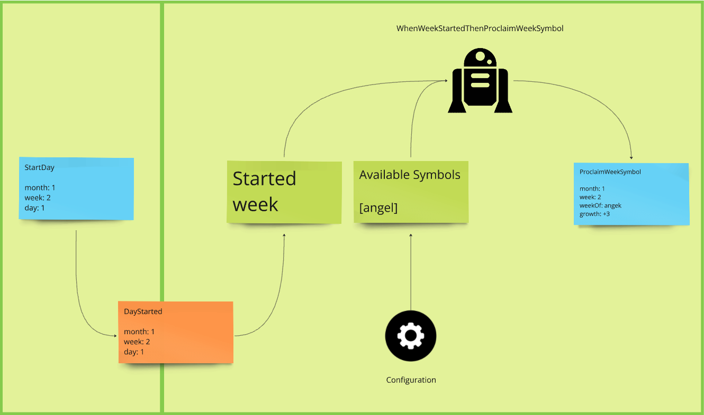

# Heroes of Domain-Driven Design (Ruby)

Shows how to use Domain-Driven Design, Event Storming, Event Modeling and Event Sourcing in Heroes of Might & Magic III domain.

- [Read the Heroes of Domain-Driven Design series on LinkedIn]( https://www.linkedin.com/build-relation/newsletter-follow?entityUrn=7208819112179908609)

This project probably won't be fully-functional HOMM3 engine implementation, because it's done for education purposes.

## How to run the project?

1. `cd heroesofddd_rails_application`
2. `docker compose up`
3. `bundle install`
4. `rails db:create`
5. `rails db:migrate`
6. `rails db:seed`
7. `rails server`

Go to the url and play around with the app: http://localhost:3000/heroes/games/fcc8f601-76cb-4b5a-972d-b7431303f69a/creature_recruitment/dwellings/cecc4307-e940-4ef2-8436-80c475729938

## Modules

Modules (mostly designed using Bounded Context heuristic) are designed and documented on EventModeling below.
Each slice in a module is in certain color which shows the progress:
- green -> completed
- yellow -> implementation in progress
- red -> to do 
- grey -> design in progress

List of modules you can see in `lib/heroes` directory of the Rails application.
```
heroes/
├── astrologers
├── calendar
├── creature_recruitment
```

### Creature Recruitment


Slices:
- Write: `BuildDwelling` -> `DwellingBuilt`
- Write: `IncreaseAvailableCreatures` -> `AvailableCreaturesChanged`
- Write: `RecruitCreatured` -> `CreatureRecruited`

### Astrologers


Slices:
- Write: `ProclaimWeekSymbol` -> `WeekSymbolProclaimed`
- Automation: When week symbol proclaimed then increase dwellings available creatures if dwelling creature == symbol

### Calendar



Slices:
- Write: `StartDay` -> `DayStarted`
- Automation: When week started (DayStarted with day == 1) then proclaim week symbol.
