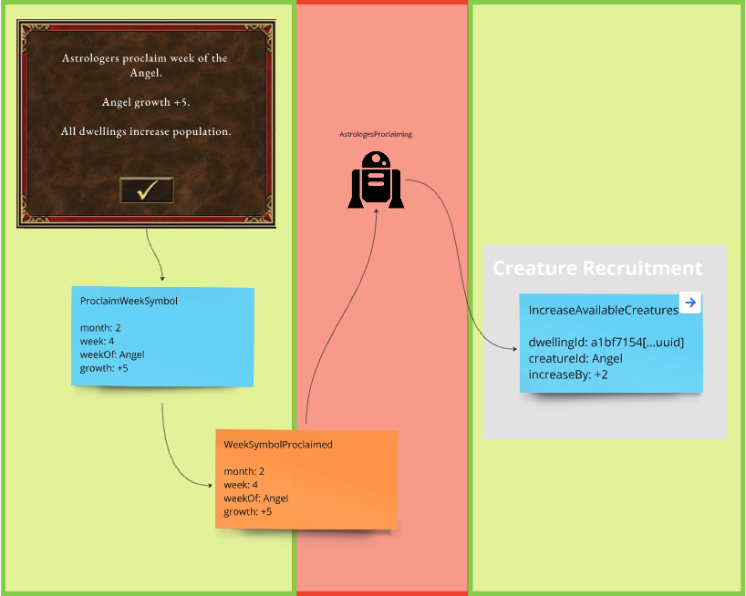

# Heroes of Domain-Driven Design (Ruby)

Shows how to use Domain-Driven Design, Event Storming, Event Modeling and Event Sourcing in Heroes of Might & Magic III domain.

- [Read the Heroes of Domain-Driven Design series on LinkedIn]( https://www.linkedin.com/build-relation/newsletter-follow?entityUrn=7208819112179908609)

This project probably won't be fully-functional HOMM3 engine implementation, because it's done for education purposes.

## Modules

Modules (mostly designed using Bounded Context heuristic) are designed and documented on EventModeling below.
Each slice in a module is in certain color which shows the progress:
- green -> completed
- yellow -> implementation in progress
- red -> to do 
- grey -> design in progress

List of modules you can see in `lib/heroes` directory of the Rails application.
```
heroes/
├── astrologers
├── creature_recruitment
```

### Creature Recruitment


### Astrologers

